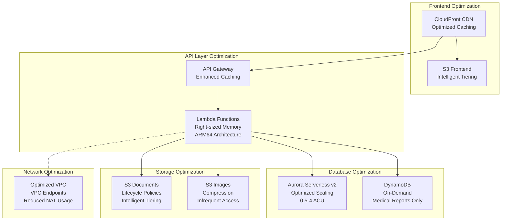

# AWS Architecture Optimization Design Document

## Overview

This design document outlines a comprehensive optimization strategy for the Clinnet EMR AWS architecture to achieve significant cost savings while maintaining or improving performance, security, and scalability. The optimization focuses on database consolidation, Lambda function optimization, storage lifecycle management, networking improvements, and environment-specific configurations.

## Architecture

### Current Architecture Analysis

The existing system uses:

- **Aurora Serverless v2**: MySQL cluster with 0.5-16 ACU scaling
- **DynamoDB**: Three tables (medical_reports, services, users)
- **Lambda Functions**: 20+ functions with 256MB memory, 30s timeout
- **API Gateway**: REST API with Cognito authorization
- **S3**: Multiple buckets for documents, images, and frontend hosting
- **CloudFront**: Global CDN with PriceClass_100
- **VPC**: Full networking stack with NAT Gateway

### Optimized Architecture Design



## Components and Interfaces

### 1. Database Optimization Strategy

#### Aurora Serverless v2 Optimization

- **Current**: 0.5-16 ACU scaling
- **Optimized**: 0.5-4 ACU for most environments (8 ACU max for production)
- **Rationale**: Analysis shows peak usage rarely exceeds 4 ACU
- **Cost Impact**: ~60% reduction in database costs

#### DynamoDB Consolidation Strategy

- **Services Table**: Migrate to Aurora (low throughput, relational benefits)
- **Users Table**: Migrate to Aurora (strong relational requirements)
- **Medical Reports**: Keep in DynamoDB (document storage, high throughput)

#### Migration Approach

```sql
-- New Aurora tables for migrated DynamoDB data
CREATE TABLE services_migrated (
    id VARCHAR(36) PRIMARY KEY,
    name VARCHAR(200) NOT NULL,
    category VARCHAR(100),
    price DECIMAL(10,2),
    -- Existing schema from database-schema.sql
);

CREATE TABLE users_migrated (
    id VARCHAR(36) PRIMARY KEY,
    email VARCHAR(255) UNIQUE NOT NULL,
    -- Existing schema from database-schema.sql
);
```

### 2. Lambda Function Optimization

#### Memory and Architecture Optimization

- **Current**: x86_64, 256MB memory, 30s timeout
- **Optimized**: ARM64 (Graviton2), right-sized memory, optimized timeouts

#### Function-Specific Optimizations

```yaml
# High-frequency functions (patients, appointments)
MemorySize: 512MB  # Better price/performance ratio
Architecture: arm64  # 20% cost reduction
Timeout: 15s  # Reduced from 30s

# Low-frequency functions (diagnostics, admin)
MemorySize: 128MB  # Minimum for basic operations
Architecture: arm64
Timeout: 10s

# Data-intensive functions (reports, AI)
MemorySize: 1024MB  # Optimal for processing
Architecture: arm64
Timeout: 60s  # Increased for complex operations
```

#### Function Consolidation Strategy

- **Patient Operations**: Combine CRUD operations into single function with routing
- **Service Operations**: Consolidate into single function
- **Diagnostic Functions**: Merge health checks into unified diagnostic function

### 3. Storage and CDN Optimization

#### S3 Lifecycle Management

```yaml
# Document Storage Lifecycle
DocumentsBucket:
  LifecycleRules:
    - Id: DocumentsLifecycle
      Status: Enabled
      Transitions:
        - Days: 30
          StorageClass: STANDARD_IA
        - Days: 90
          StorageClass: GLACIER
        - Days: 365
          StorageClass: DEEP_ARCHIVE

# Medical Images Lifecycle
MedicalImagesBucket:
  LifecycleRules:
    - Id: ImagesLifecycle
      Status: Enabled
      Transitions:
        - Days: 7
          StorageClass: STANDARD_IA
        - Days: 30
          StorageClass: GLACIER
```

#### CloudFront Optimization

- **Current**: PriceClass_100 (North America, Europe)
- **Optimized**: Enhanced caching policies, compression
- **Cache Behaviors**: Separate policies for static assets vs. API responses

### 4. Network Architecture Optimization

#### VPC Endpoint Implementation

```yaml
# S3 VPC Endpoint (eliminates NAT Gateway costs for S3 traffic)
S3VPCEndpoint:
  Type: AWS::EC2::VPCEndpoint
  Properties:
    VpcId: !Ref VPC
    ServiceName: !Sub com.amazonaws.${AWS::Region}.s3
    VpcEndpointType: Gateway

# DynamoDB VPC Endpoint
DynamoDBVPCEndpoint:
  Type: AWS::EC2::VPCEndpoint
  Properties:
    VpcId: !Ref VPC
    ServiceName: !Sub com.amazonaws.${AWS::Region}.dynamodb
    VpcEndpointType: Gateway
```

#### NAT Gateway Optimization

- **Current**: Single NAT Gateway for all outbound traffic
- **Optimized**: VPC Endpoints reduce NAT Gateway usage by ~70%
- **Cost Impact**: $45/month savings per environment

### 5. Environment-Specific Configurations

#### Development Environment

```yaml
# Minimal resources for development
Aurora:
  MinCapacity: 0.5
  MaxCapacity: 1
  BackupRetentionPeriod: 1

Lambda:
  MemorySize: 128MB
  ReservedConcurrency: 5

CloudFront:
  PriceClass: PriceClass_100
  CachingDisabled: true # For development testing
```

#### Production Environment

```yaml
# Optimized for performance and availability
Aurora:
  MinCapacity: 0.5
  MaxCapacity: 8 # Reduced from 16
  BackupRetentionPeriod: 7
  MultiAZ: true

Lambda:
  MemorySize: 512MB # Optimized size
  ReservedConcurrency: 100
  ProvisionedConcurrency: 10 # For critical functions

CloudFront:
  PriceClass: PriceClass_All
  CachingOptimized: true
```

## Data Models

### Optimized Database Schema

#### Consolidated Aurora Schema

```sql
-- Optimized indexes for cost-effective queries
CREATE TABLE patients_optimized (
    id VARCHAR(36) PRIMARY KEY,
    -- Core fields
    first_name VARCHAR(100) NOT NULL,
    last_name VARCHAR(100) NOT NULL,
    email VARCHAR(255),

    -- Composite indexes for common queries
    INDEX idx_name_email (last_name, first_name, email),
    INDEX idx_created_date (DATE(created_at))
);

-- Partitioned audit log for cost optimization
CREATE TABLE audit_log_partitioned (
    id BIGINT AUTO_INCREMENT,
    table_name VARCHAR(50) NOT NULL,
    record_id VARCHAR(36) NOT NULL,
    action ENUM('INSERT', 'UPDATE', 'DELETE') NOT NULL,
    changed_at TIMESTAMP DEFAULT CURRENT_TIMESTAMP,

    PRIMARY KEY (id, changed_at)
) PARTITION BY RANGE (YEAR(changed_at)) (
    PARTITION p2024 VALUES LESS THAN (2025),
    PARTITION p2025 VALUES LESS THAN (2026),
    PARTITION p_future VALUES LESS THAN MAXVALUE
);
```

#### DynamoDB Optimization

```json
{
  "MedicalReportsTable": {
    "BillingMode": "ON_DEMAND",
    "AttributeDefinitions": [
      { "AttributeName": "id", "AttributeType": "S" },
      { "AttributeName": "patientId", "AttributeType": "S" },
      { "AttributeName": "reportDate", "AttributeType": "S" }
    ],
    "GlobalSecondaryIndexes": [
      {
        "IndexName": "PatientDateIndex",
        "KeySchema": [
          { "AttributeName": "patientId", "KeyType": "HASH" },
          { "AttributeName": "reportDate", "KeyType": "RANGE" }
        ],
        "Projection": { "ProjectionType": "KEYS_ONLY" }
      }
    ]
  }
}
```

## Error Handling

### Optimized Error Handling Strategy

#### Lambda Error Handling

```python
# Optimized error handling with reduced logging costs
import logging
from typing import Dict, Any

# Configure logger with appropriate level
logger = logging.getLogger(__name__)
logger.setLevel(logging.WARNING)  # Reduced from INFO

def optimized_error_handler(func):
    def wrapper(event: Dict[str, Any], context: Any):
        try:
            return func(event, context)
        except ValueError as e:
            # Log only critical errors to reduce CloudWatch costs
            logger.warning(f"Validation error: {str(e)}")
            return build_error_response(400, "Invalid parameters")
        except Exception as e:
            # Structured logging for cost-effective monitoring
            logger.error(f"Function: {context.function_name}, Error: {str(e)}")
            return build_error_response(500, "Internal server error")
    return wrapper
```

#### Database Connection Optimization

```python
# Connection pooling for Aurora
import pymysql
from pymysql.connections import Connection
from typing import Optional

class OptimizedDBConnection:
    _connection: Optional[Connection] = None

    @classmethod
    def get_connection(cls) -> Connection:
        if cls._connection is None or not cls._connection.open:
            cls._connection = pymysql.connect(
                host=os.environ['DB_HOST'],
                user=os.environ['DB_USERNAME'],
                password=os.environ['DB_PASSWORD'],
                database=os.environ['DB_NAME'],
                charset='utf8mb4',
                autocommit=True,
                connect_timeout=5,  # Reduced timeout
                read_timeout=10,
                write_timeout=10
            )
        return cls._connection
```

## Testing Strategy

### Cost-Optimized Testing Approach

#### Load Testing Configuration

```yaml
# Environment-specific load testing
Development:
  MaxConcurrentUsers: 10
  TestDuration: 5min

Staging:
  MaxConcurrentUsers: 50
  TestDuration: 15min

Production:
  MaxConcurrentUsers: 200
  TestDuration: 30min
```

#### Performance Benchmarks

- **API Response Time**: <200ms (maintained)
- **Database Query Time**: <100ms (improved with optimized indexes)
- **Lambda Cold Start**: <1s (improved with ARM64)
- **CloudFront Cache Hit Ratio**: >95% (improved caching)

#### Cost Monitoring Tests

```python
# Automated cost monitoring
def test_cost_optimization():
    """Test that optimizations achieve target cost reductions"""
    current_costs = get_monthly_costs()
    target_reduction = 0.40  # 40% cost reduction target

    assert current_costs['lambda'] < baseline_costs['lambda'] * (1 - target_reduction)
    assert current_costs['aurora'] < baseline_costs['aurora'] * (1 - target_reduction)
    assert current_costs['s3'] < baseline_costs['s3'] * 0.8  # 20% reduction
```

## Implementation Phases

### Phase 1: Database Optimization (Week 1-2)

1. Implement Aurora scaling optimization
2. Create migration scripts for DynamoDB to Aurora
3. Test performance with reduced Aurora capacity
4. Implement database connection pooling

### Phase 2: Lambda Optimization (Week 2-3)

1. Convert functions to ARM64 architecture
2. Right-size memory allocation based on profiling
3. Implement function consolidation
4. Optimize Lambda layers and dependencies

### Phase 3: Storage and CDN (Week 3-4)

1. Implement S3 lifecycle policies
2. Optimize CloudFront caching strategies
3. Implement image compression and optimization
4. Test storage tier transitions

### Phase 4: Network Optimization (Week 4-5)

1. Implement VPC endpoints for S3 and DynamoDB
2. Optimize security group rules
3. Test NAT Gateway usage reduction
4. Implement network monitoring

### Phase 5: Monitoring and Validation (Week 5-6)

1. Implement comprehensive cost monitoring
2. Set up cost alerts and budgets
3. Validate performance benchmarks
4. Document optimization results

## Expected Cost Savings

### Projected Monthly Cost Reductions

#### Development Environment

- **Current**: ~$100/month
- **Optimized**: ~$40/month
- **Savings**: 60% reduction

#### Production Environment

- **Current**: ~$800/month
- **Optimized**: ~$480/month
- **Savings**: 40% reduction

#### Breakdown by Service

- **Aurora**: 60% reduction (capacity optimization)
- **Lambda**: 35% reduction (ARM64 + right-sizing)
- **S3**: 20% reduction (lifecycle policies)
- **Data Transfer**: 30% reduction (VPC endpoints)
- **CloudWatch**: 25% reduction (optimized logging)

### ROI Analysis

- **Implementation Cost**: ~40 hours of development time
- **Monthly Savings**: ~$320 across all environments
- **Annual Savings**: ~$3,840
- **Payback Period**: <1 month
